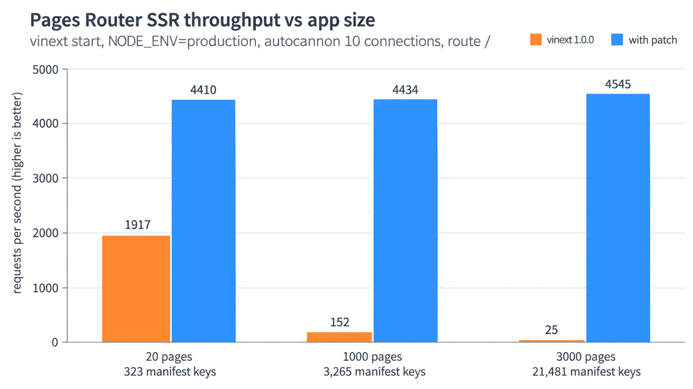

# vinext Pages Router: every SSR request scans the whole SSR manifest

**vinext 1.0.0 walks the full SSR manifest on every Pages Router request, so the cost per request grows with app size.**
A 3000-page app serves 25 req/s; with the [patch](patches/vinext-1.0.0-cache-manifest-lookups.patch), which caches the lookups per manifest, it serves 4545 req/s with byte-identical HTML.



## Repro

```sh
npm i
npm run compare                           # about 3 minutes
npm run compare -- --profile 3000:12000   # also writes a CPU profile of the unpatched server to profiles/
```

`compare` generates the app at each size, builds and benchmarks it with and without the patch, and checks that `/` and `/p/1` serve the same HTML.

## Numbers

`/` of a synthetic app, `vinext start` with `NODE_ENV=production`, autocannon with 10 connections for 10 s, one Node process:

| pages | components | ssr-manifest keys | size | vinext 1.0.0 req/s (p50) | with patch req/s (p50) |
|---:|---:|---:|---:|---:|---:|
| 20 | 100 | 323 | 0.05 MB | 1917 (4 ms) | 4410 (1 ms) |
| 1000 | 4000 | 3265 | 1.0 MB | 152 (58 ms) | 4434 (1 ms) |
| 3000 | 12000 | 21481 | 4.5 MB | 25 (352 ms) | 4545 (1 ms) |

A real app with a 51 MB SSR manifest (31k keys) served 5 req/s, with `collectAssetTags` at 58% self time.

## Cause

All in [`pages-asset-tags.ts`](https://github.com/cloudflare/vinext/blob/ca67493fb4f4599dedd55b10e56808424371de6a/packages/vinext/src/server/pages-asset-tags.ts) (1.0.0, unchanged on `main`). The results depend only on the build and the route, yet each request recomputes them. CPU shares from an unminified build of the 3000-page app:

| share | what |
|---:|---|
| 32% | [Shared-chunk scan in `collectAssetTags`](https://github.com/cloudflare/vinext/blob/ca67493fb4f4599dedd55b10e56808424371de6a/packages/vinext/src/server/pages-asset-tags.ts#L254-L273): visits every file of every manifest key and runs `split("/").pop()` to find `framework-` / `vinext-` chunks. The result holds one copy per module that references them. |
| 22% | [`getManifestFilesForModule`](https://github.com/cloudflare/vinext/blob/ca67493fb4f4599dedd55b10e56808424371de6a/packages/vinext/src/server/pages-asset-tags.ts#L44-L51): the handler passes absolute paths, manifest keys are root-relative, so the exact lookup always misses and falls back to an `endsWith` scan over all keys, four times per request. |
| 12% | [`resolveSsrManifest`](https://github.com/cloudflare/vinext/blob/ca67493fb4f4599dedd55b10e56808424371de6a/packages/vinext/src/server/pages-asset-tags.ts#L28): `Object.keys(manifest).length` three times per request, only to check the manifest is not empty. An early-return `for...in` does not help: V8 still collects all keys. |
| 3% | [`findKey` in `collectGraphOrderedCss`](https://github.com/cloudflare/vinext/blob/ca67493fb4f4599dedd55b10e56808424371de6a/packages/vinext/src/server/pages-asset-tags.ts#L63-L70): the same suffix scan over `cssGraph`. |
| 1% | [`new Set(lazyChunks)`](https://github.com/cloudflare/vinext/blob/ca67493fb4f4599dedd55b10e56808424371de6a/packages/vinext/src/server/pages-asset-tags.ts#L201) on every request (8920 entries). Small here, but it takes most of the CPU once the scans are gone. |

Each scan is linear in the manifest size (all keys, and for the shared-chunk scan all files under each key). The unpatched p50 grows roughly in step with it: 0.05 → 4.5 MB, 4 → 352 ms.

## Fix

The [patch](patches/vinext-1.0.0-cache-manifest-lookups.patch) edits the built `dist/server/pages-asset-tags.js` and caches, in a `WeakMap`/`WeakSet` keyed by the manifest object:

- the suffix lookup per module id (shared by `getManifestFilesForModule` and `findKey`)
- the deduplicated shared-chunk list
- the non-empty check
- one `Set` per `lazyChunks` array

Tag strings stay per request because of the nonce. A build-time fix would also work: key the lookup by the root-relative path and emit the shared-chunk list and lazy-chunk set with the client assets.

## Manual steps

```sh
npm run generate -- 3000 12000 && npm run build && npm start
npm run bench        # in a second terminal
npm run patch        # or npm run unpatch; rebuild afterwards
```

vinext bundles its server code into `dist/server`, so apply the patch before `vite build`.

## Environment

vinext 1.0.0, vite 8.3.0, rolldown 1.2.11, react 19.2.8, Node 24.13.0, macOS 26.6, Apple M1 Max.
